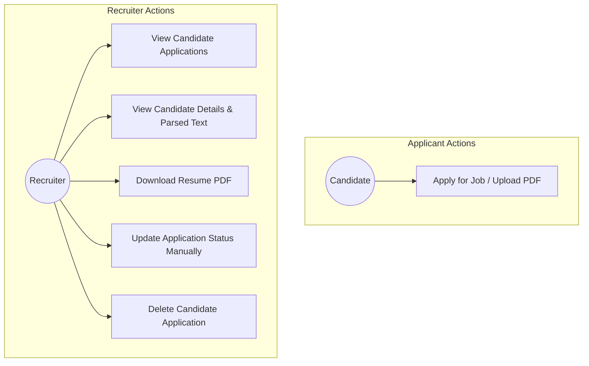
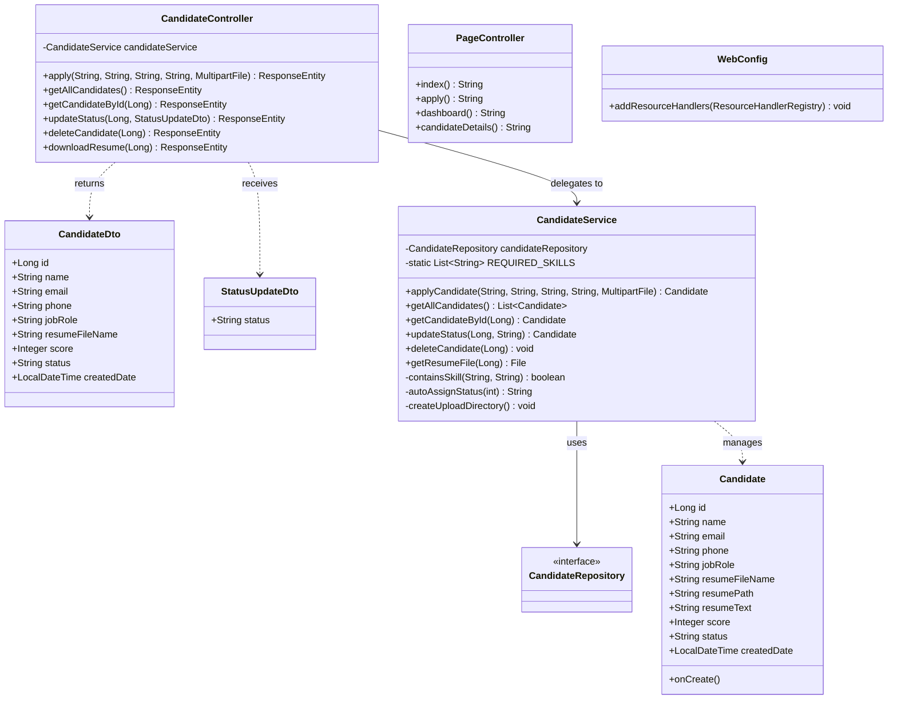
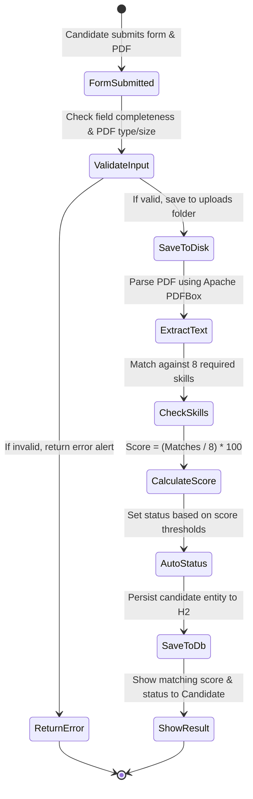
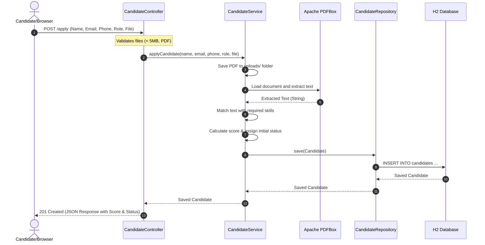
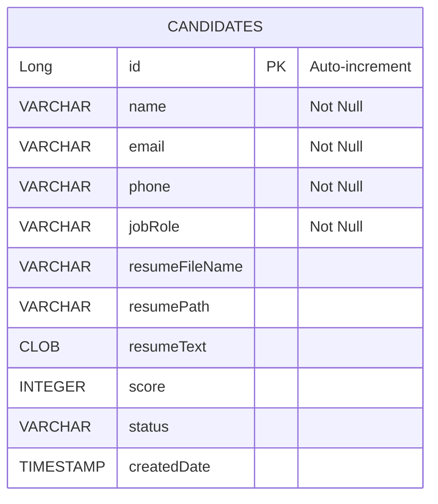

# MINI-PROJECT REPORT
## RESUME SCREENING & APPLICATION TRACKING SYSTEM

---

### 1. COVER PAGE

**Project Title:** Resume Screening & Application Tracking System  
**Course:** Bachelor of Technology / Computer Science & Engineering  
**Academic Year:** 2025 - 2026  
**Submitted By:** [Student Name] (Roll No: [Roll Number])  
**Guided By:** [Supervisor Name], Department of Computer Science & Engineering  
**Institution:** [College Name]  

---

### 2. CERTIFICATE

This is to certify that the project report entitled **"Resume Screening & Application Tracking System"** is a bonafide work carried out by **[Student Name]** in partial fulfillment of the requirements for the award of the degree of Bachelor of Technology in Computer Science & Engineering during the academic year 2025-2026.

This work has been carried out under my supervision and guidance.

<br><br>

**[Supervisor Name]**  
Project Guide  
Department of CSE  

**[Head of Department Name]**  
Head of Department  
Department of CSE  

---

### 3. ACKNOWLEDGEMENT

I express my deepest gratitude to our Principal, **[Principal Name]**, and our Head of Department, **[HOD Name]**, for providing the necessary facilities and an encouraging environment to complete this project.

I am highly indebted to my guide, **[Supervisor Name]**, for their valuable guidance, constant encouragement, and constructive suggestions during various phases of the project.

Lastly, I thank my family and peers who directly or indirectly assisted me in the successful completion of this mini-project.

**- [Student Name]**

---

### 4. ABSTRACT

With the massive influx of job applications, recruiters face the challenge of scanning hundreds of resumes daily. Manual screening is time-consuming, prone to human bias, and inefficient. To solve this problem, this mini-project implements a lightweight, fully automated **Resume Screening & Application Tracking System (ATS)**.

The system is built as a single-executable Spring Boot application utilizing Java 17, an embedded H2 Database, and Apache PDFBox for parsing PDF resumes. The system allows candidates to upload resumes, extracts raw text content, screens the content against a list of 8 core technical skills (`Java`, `Spring Boot`, `HTML`, `CSS`, `JavaScript`, `SQL`, `MySQL`, and `Git`), and calculates a percentage matching score. Candidates are auto-categorized into status bands: Highly Recommended, Shortlisted, Under Review, or Rejected. Recruiters are provided with an interactive glassmorphic dashboard where they can search profiles, manually override statuses, download resumes, or delete applications. The system offers a self-contained, lightweight, and visual portal tailored for streamlined academic evaluation.

---

### 5. INTRODUCTION

The recruitment process consists of multiple stages, starting from sourcing applications to hiring. The most labor-intensive step is the initial screening of resumes. Traditional methods involve manually opening and scanning each resume file, leading to slow turnaround times.

This project introduces a web-based automated solution that combines resume text parsing with an application tracking workflow. By integrating the Apache PDFBox library with a Spring Boot backend, the application eliminates manual file reading. It automatically matches candidates to pre-defined competencies, ranks them, and presents them in a unified web-based tracker. It provides a visual dashboard for recruiter workflows without requiring complex microservices or external databases.

---

### 6. PROBLEM STATEMENT

Manual resume screening suffers from several core challenges:
1. **High Volume & Low Velocity:** Recruiters spend an average of 6-8 seconds per resume, which accumulates to hours when dealing with hundreds of applicants.
2. **Human Bias:** Manual screening is susceptible to inconsistent evaluations.
3. **Tracking Fragmentation:** Managing candidate statuses across email threads, spreadsheets, and file directories leads to loss of information.
4. **Tool Over-complexity:** Existing commercial ATS software is expensive, requires complex setup, external databases, cloud services, and complex login flows.

This project aims to deliver a **simple, self-contained, single-executable application** that solves the core screening and tracking problems without any operational overhead.

---

### 7. EXISTING SYSTEM

In many small-to-medium enterprises and educational institutions, recruitment tracking is done using:
- **Spreadsheets (Excel/Google Sheets):** Manual entry of candidate details.
- **Shared File Directories:** Storing resumes in local folders.
- **Email Inboxes:** Receiving resumes individually.

**Disadvantages of the Existing System:**
- No automated text parsing; resumes must be manually opened.
- No objective ranking system.
- Risk of duplicate submissions or lost files.
- Lack of centralized tracking status.

---

### 8. PROPOSED SYSTEM

The proposed **Resume Screening & Application Tracking System** addresses the drawbacks of the existing system by providing:
- **Automatic PDF Processing:** Immediate text extraction on upload.
- **Skill Screening Engine:** Real-time key competency scoring.
- **Centralized Database Storage:** Storing applicant data, scores, and text content in H2.
- **Recruiter Tracking Pipeline:** A responsive dashboard for status tracking, search, downloads, and deletion.
- **Zero Configuration Run:** Uses an embedded database and standard assets so it starts in one command.

---

### 9. OBJECTIVES

1. Develop a web form to capture candidate details and validate PDF resumes (max 5MB).
2. Extract text from PDF documents programmatically using Apache PDFBox.
3. Establish a matching logic based on 8 key skills to compute candidate compatibility.
4. Dynamically assign status bands to automate filtering.
5. Create a glassmorphic dashboard displaying metrics, candidate records, and action buttons.
6. Provide manual status overrides via drop-down controls.
7. Support client-side real-time search filters.
8. Ensure physical resume files and database records are synchronized during deletes.

---

### 10. SCOPE

The scope of this project is to serve as an academic mini-project demonstrating core software engineering principles:
- File handling and storage in Java.
- PDF document parsing.
- REST API design in Spring Boot.
- ORM database mapping with H2.
- Interactive front-end UI design with Bootstrap and AJAX.
- Clean separation of concerns (MVC architecture).

**Out of Scope:** Multi-tenant recruiter accounts, JWT logins, machine learning parsing, and email notifications. These are excluded to maintain simplicity and ease of viva explanation.

---

### 11. FUNCTIONAL REQUIREMENTS

- **FR1 (Submit Application):** Candidate must be able to input Name, Email, Phone, Job Role, and upload a PDF resume.
- **FR2 (Validation):** Form must block non-PDF files, file sizes $>5$MB, and blank fields.
- **FR3 (Text Parsing):** The system must read the PDF stream and extract readable string content.
- **FR4 (Scoring):** The system must match the text against 8 skills and assign a score ($0\%$ to $100\%$).
- **FR5 (Auto Status):** The system must auto-categorize status based on scoring bounds.
- **FR6 (Dashboard Metrics):** The dashboard must calculate dynamic cards for applications, shortlists, selected, and rejected.
- **FR7 (Status Management):** Recruiter must be able to override status using dropdowns.
- **FR8 (Search):** Recruiter must be able to filter tables dynamically by name or email.
- **FR9 (File Retrieval & Deletion):** Recruiter must be able to download PDF files or delete records.

---

### 12. NON-FUNCTIONAL REQUIREMENTS

- **NFR1 (Performance):** Text parsing and scoring should complete in under 2 seconds.
- **NFR2 (Usability):** Responsive layout accessible across desktop, tablet, and mobile browsers.
- **NFR3 (Portability):** The application should run on any OS (Windows, macOS, Linux) with Java 17 and Maven.
- **NFR4 (Reliability):** Use file-based DB persistence to prevent data loss on restarts.
- **NFR5 (Security):** Keep uploads and databases secure locally.

---

### 13. SYSTEM ARCHITECTURE

The application follows the classic Model-View-Controller (MVC) architectural pattern:

```
┌────────────────────────────────────────────────────────┐
│                        VIEW                            │
│    (HTML5 / CSS3 Glassmorphism / Bootstrap 5 / JS)     │
└───────────┬────────────────────────────▲───────────────┘
            │ HTTP Request (AJAX)         │ JSON / Binary
            ▼                             │
┌────────────────────────────────────────┴───────────────┐
│                     CONTROLLER                         │
│     (CandidateController / PageController / WebConfig) │
└───────────┬────────────────────────────▲───────────────┘
            │ Method Invocation           │ Entities / DTOs
            ▼                             │
┌────────────────────────────────────────┴───────────────┐
│                       SERVICE                          │
│         (CandidateService / Apache PDFBox)             │
└───────────┬────────────────────────────▲───────────────┘
            │ Repository Call             │ Entity Objects
            ▼                             │
┌────────────────────────────────────────┴───────────────┐
│                     REPOSITORY                         │
│               (CandidateRepository)                    │
└───────────┬────────────────────────────▲───────────────┘
            │ SQL Queries                 │ JDBC ResultSet
            ▼                             │
┌────────────────────────────────────────┴───────────────┐
│                     DATABASE                           │
│                 (H2 Embedded DB)                       │
└────────────────────────────────────────────────────────┘
```

---

### 14. USE CASE DIAGRAM

The use case diagram highlights the interactions of Candidates and Recruiters with the system.



---

### 15. CLASS DIAGRAM

The class diagram maps the static structure of controllers, services, repositories, entities, and DTOs.



---

### 16. ACTIVITY DIAGRAM

This activity diagram traces the workflow of submitting an application, text extraction, and auto-scoring.



---

### 17. SEQUENCE DIAGRAM

This sequence diagram displays the step-by-step API message exchange for resume submissions.



---

### 18. ER DIAGRAM

The ER diagram represents the data schema structure of the candidate entity.



---

### 19. DATABASE DESIGN

The system uses a single table `candidates` inside the embedded H2 database.

| Column Name | Data Type | Constraints | Description |
| :--- | :--- | :--- | :--- |
| **id** | `BIGINT` | Primary Key, Auto-Increment | Unique identifier for each candidate |
| **name** | `VARCHAR(255)` | Not Null | Candidate full name |
| **email** | `VARCHAR(255)` | Not Null | Candidate email address |
| **phone** | `VARCHAR(255)` | Not Null | Candidate contact number |
| **job_role** | `VARCHAR(255)` | Not Null | Job role applied for |
| **resume_file_name** | `VARCHAR(255)` | Nullable | Original uploaded file name |
| **resume_path** | `VARCHAR(255)` | Nullable | Absolute path to saved file in uploads/ |
| **resume_text** | `CLOB` | Nullable | Raw text extracted from PDF |
| **score** | `INTEGER` | Nullable | Matching percentage score (0-100) |
| **status** | `VARCHAR(255)` | Nullable | Candidate application tracking status |
| **created_date** | `TIMESTAMP` | Nullable | Application timestamp |

---

### 20. TECHNOLOGY STACK

- **Java Development Kit (JDK 17):** Modern Java programming language features.
- **Spring Boot 3.1.5:** Framework offering rapid development, built-in Tomcat web server, and minimal XML configurations.
- **Spring Data JPA & Hibernate:** High-level ORM database connectivity layer.
- **H2 Embedded Database:** Lightweight SQL engine running locally. Persisted using file-based storage.
- **Apache PDFBox 2.0.30:** Java library designed for parsing and extracting text from PDF structures.
- **HTML5 & CSS3:** Structural components and custom glassmorphism styling.
- **Vanilla JavaScript (ES6+):** Performing asynchronous REST calls (`fetch`), updating CSS classes, and rendering tables dynamically.
- **Bootstrap 5:** Frontend framework providing grids, forms, tables, and spacing helpers.
- **Maven:** Package manager and compilation command-line builder.

---

### 21. MODULE DESCRIPTION

1. **Home Landing Module (`index.html`):** Renders a modern landing page containing the project title, information cards, navigation links, and action buttons.
2. **Apply Form Module (`apply.html`, `app.js`):** Collects user information, verifies PDF file limits, presents validation alerts, and handles AJAX file transmission. Shows results inside an interactive modal post-upload.
3. **Text Extraction Module (`CandidateService.java`):** Captures the binary stream from files, initializes Apache PDFBox's text stripper, and outputs raw text.
4. **Screening Module (`CandidateService.java`):** Scans the parsed text case-insensitively using regex word boundaries to search for: Java, Spring Boot, HTML, CSS, JavaScript, SQL, MySQL, and Git.
5. **Status Assignment Module (`CandidateService.java`):** Applies rules to translate percentage scores into status designations (Highly Recommended, Shortlisted, Under Review, Rejected).
6. **Recruiter Tracker Module (`dashboard.html`, `app.js`):** Integrates statistics cards, search bars, candidate tables, details links, resume download requests, and candidate deletion.
7. **Status overrides Module (`candidate-details.html`, `app.js`):** Connects dropdown selectors to PUT APIs to update statuses manually.

---

### 22. TESTING

The application was verified through manual test cases:

| Test Case ID | Test Scenario | Input Data | Expected Result | Actual Result | Status |
| :--- | :--- | :--- | :--- | :--- | :--- |
| **TC01** | Apply Form Blank Submit | Empty Fields | Block submit, show red validation borders. | Blocked submit, showed borders. | **PASS** |
| **TC02** | Invalid File Format Upload | Upload `photo.jpg` | Show "Only PDF resumes are accepted" error. | Error displayed, file reset. | **PASS** |
| **TC03** | Max File Size Upload Check | Upload 6MB PDF resume | Show "Resume file size must be less than 5 MB" error. | Error displayed, file reset. | **PASS** |
| **TC04** | Text Extraction & Scoring | PDF resume containing "Java", "SQL", "Git" | Extracted text successfully, calculated score: $3/8 = 38\%$, set status to `Rejected`. | Parsed text, score set to 38%, status Rejected. | **PASS** |
| **TC05** | High Match Scoring | PDF resume containing all 8 skills | Score calculated as $100\%$, status set to `Highly Recommended`. | Score set to 100%, status Highly Recommended. | **PASS** |
| **TC06** | Recruiter Search Filter | Typing "John" in search bar | Display only rows where name or email contains "John". | Dynamic row filtering in real-time. | **PASS** |
| **TC07** | Status Update | Changing dropdown option to `Selected` | DB updated, Selected metrics card increments. | Updated in DB, UI updated immediately. | **PASS** |
| **TC08** | Delete candidate | Click delete on ID 1 | Record deleted, file removed from uploads/ folder. | DB cleared, file deleted, page updated. | **PASS** |

---

### 23. ADVANTAGES

- **Lightweight & Portable:** Run the entire package with a single Maven command.
- **Reliable Persistence:** Local file database ensures candidates are saved across system restarts.
- **Glassmorphic Modern UI:** Dark, premium design matching contemporary web aesthetics.
- **Fast Parsing:** Apache PDFBox extracts text and calculates scores in milliseconds.
- **No Complex Dependencies:** Avoids complex microservices, Docker configs, or cloud accounts.
- **High educational value:** Transparently exposes parsed resume text and matches skills.

---

### 24. LIMITATIONS

- **Exact Phrase Matching:** Relies on string checking and regex boundaries. Variations in writing skills (e.g. "JS" instead of "JavaScript") might fail unless listed in the resume text.
- **Single Recruiter Flow:** Excludes multi-user logins or login pages to remain simple for viva demonstrations.
- **PDF Only:** Word files (`.docx`) are not supported directly.

---

### 25. FUTURE SCOPE

- **Semantic Skill Parsing:** Integrating NLP libraries (e.g. Apache OpenNLP) to match synonyms.
- **Multi-Role Profiling:** Allow recruiters to add custom required skills for different job roles dynamically via a configuration dashboard.
- **Email Notifications:** Automatically email candidates when their status changes (e.g. Interview Scheduled).
- **OAuth Login:** Add secure OAuth2 logins for recruiters.

---

### 26. CONCLUSION

The **Resume Screening & Application Tracking System** successfully fulfills the requirements of a college mini-project. It integrates backend Java engineering (Spring Boot, JPA, PDFBox) with a beautiful glassmorphic front-end interface. The system automates the screening process, ranks candidates using an objective skill match formula, and organizes them in a real-time tracking pipeline. It is portable, functional, and simple to demonstrate.

---

### 27. REFERENCES

1. Spring Boot Official Documentation: [https://spring.io/projects/spring-boot](https://spring.io/projects/spring-boot)
2. Apache PDFBox Developer Guide: [https://pdfbox.apache.org](https://pdfbox.apache.org)
3. H2 Embedded SQL Documentation: [http://www.h2database.com](http://www.h2database.com)
4. Bootstrap 5 Components: [https://getbootstrap.com](https://getbootstrap.com)
5. MDN Web Docs - Fetch API & Vanilla JS: [https://developer.mozilla.org](https://developer.mozilla.org)

---
---

## 28. VIVA PREPARATION: 30 QUESTIONS & ANSWERS

### Q1. What is Spring Boot, and why did you use it?
**Answer:** Spring Boot is an extension of the Spring framework that eliminates boilerplate configuration (like XML files) and provides a "convention-over-configuration" approach. It includes an embedded Tomcat server, enabling developers to run web applications immediately as a jar or maven task. We used it to build a portable, single-executable application.

### Q2. How is this project structured?
**Answer:** The project follows the **MVC (Model-View-Controller)** pattern:
- **Entity:** Represents the database schema (`Candidate.java`).
- **Repository:** Manages database operations (`CandidateRepository.java`).
- **Service:** Contains business logic for text extraction and scoring (`CandidateService.java`).
- **Controller:** Exposes endpoints (`CandidateController.java`) and maps page views (`PageController.java`).
- **View:** HTML, CSS, and JS files located in `src/main/resources/static`.

### Q3. How does the application extract text from PDF resumes?
**Answer:** We integrated **Apache PDFBox**. When a file is uploaded, the backend saves it to disk and reads its input stream. We pass this file to `PDDocument.load()` and apply the `PDFTextStripper` class to extract characters and return the content as a single Java string.

### Q4. Which skills does the system check, and how is the score calculated?
**Answer:** The system screens resumes for 8 predefined skills: `Java`, `Spring Boot`, `HTML`, `CSS`, `JavaScript`, `SQL`, `MySQL`, and `Git`. The formula is:
$$\text{Score} = \left(\frac{\text{Matched Skills}}{8}\right) \times 100$$
Each matched skill adds $12.5\%$ to the score, which is rounded to the nearest integer.

### Q5. Explain the status assignment logic based on scores.
**Answer:** The initial status is set automatically using the score:
- **80% to 100%:** Highly Recommended
- **60% to 79%:** Shortlisted
- **40% to 59%:** Under Review
- **0% to 39%:** Rejected

### Q6. How are status updates managed manually by the recruiter?
**Answer:** The dashboard provides a dropdown menu for each candidate. When changed, a Vanilla JS function sends an AJAX `PUT` request to `/candidate/status/{id}` with the new status as a JSON payload. The backend updates the candidate's status, and the front-end dynamically updates the statistics cards without reloading the page.

### Q7. What database did you use, and where is the data stored?
**Answer:** We used the **H2 Embedded Database**. Unlike in-memory databases, we configured it to store data in a local file under the `./data/ats_db` directory. This ensures data is persistent and not lost when the application is restarted.

### Q8. What dependencies are in your `pom.xml`?
**Answer:** The pom.xml includes:
- `spring-boot-starter-web` for REST controllers.
- `spring-boot-starter-data-jpa` for Hibernate integration.
- `h2` for database storage.
- `spring-boot-starter-validation` for input checks.
- `pdfbox` for PDF text extraction.

### Q9. How do you ensure that only PDF files under 5MB are uploaded?
**Answer:** We implement validation at two layers:
1. **Frontend:** Custom JS checking the file extension (`.pdf`) and size (`file.size <= 5 * 1024 * 1024`) before submitting the form.
2. **Backend:** In `CandidateController.java`, we check `file.getOriginalFilename().toLowerCase().endsWith(".pdf")` and `file.getSize() > 5 * 1024 * 1024` returning a `400 Bad Request` if invalid.

### Q10. What happens when a candidate is deleted?
**Answer:** The recruiter clicks the delete button, triggering a `DELETE` request to `/candidate/{id}`. The backend calls `CandidateService.deleteCandidate()`, which deletes the record from the database and uses Java's file API (`Files.deleteIfExists()`) to remove the physical PDF file from the `uploads/` directory.

### Q11. Why did you choose to write standard getters and setters instead of using Lombok?
**Answer:** We chose to use standard Java getters and setters to ensure maximum compile-time portability. Lombok requires an annotation processor to be active in the compilation environment. In command-line environments (like standard Windows Command Prompt) or basic IDE setups, the absence of this processor results in compilation errors (such as 'cannot find symbol: method getId()'). Manual implementation ensures that the code compiles out of the box on any system, keeping it simple to run and clear to explain.

### Q12. Explain the purpose of `PageController.java`.
**Answer:** In a standard Spring Boot setup, static HTML files are served at their literal name (e.g. `/apply.html`). To make URLs look clean, `PageController.java` forwards clean routes like `/apply` and `/dashboard` to their static paths (e.g. `forward:/apply.html`).

### Q13. How does the dashboard search bar filter candidates?
**Answer:** When the recruiter types a query, a keyup event calls `filterCandidates()`. It scans the cached client-side array `allCandidates` and performs a case-insensitive check on `name` or `email`, re-rendering only the matching rows.

### Q14. What does `@Lob` and `@Column(columnDefinition = "CLOB")` do in the Candidate entity?
**Answer:** Extracted resume text can be very long (often exceeding 4000 characters). The `@Lob` annotation designates the field as a Large Object, and `columnDefinition = "CLOB"` tells Hibernate to map it to a Character Large Object in SQL, ensuring long text doesn't cause character limits or stack overflow errors.

### Q15. How does the application prevent partial keyword matches (e.g., matching "git" in "digital")?
**Answer:** The backend uses regular expressions with word boundary markers (`\b`) for letters-only skills:
```java
String regex = "\\b" + Pattern.quote(lowerSkill) + "\\b";
```
This ensures "Git" is only matched as a standalone word. For multi-word skills like "Spring Boot", it falls back to a standard substring search.

### Q16. How did you connect the frontend to the backend REST APIs?
**Answer:** We used Vanilla JavaScript's **Fetch API** to make asynchronous HTTP requests. The frontend sends JSON payloads or `FormData` (for multipart file uploads) and processes the responses.

### Q17. How is the H2 Console accessed?
**Answer:** H2 Console is enabled in `application.properties` and is accessible at `http://localhost:8080/h2-console`. The JDBC connection string must match `jdbc:h2:file:./data/ats_db`.

### Q18. What is the role of `WebConfig.java`?
**Answer:** It overrides Spring Boot's resource handler registry to map the `/uploads/**` URL pattern directly to the `uploads/` directory in the project's root folder. This allows the system to serve files if needed.

### Q19. What is `@RestController`, and how does it differ from `@Controller`?
**Answer:** `@RestController` is a convenience annotation that combines `@Controller` and `@ResponseBody`. It indicates that the class handles HTTP request mappings and automatically serializes the return objects (like Candidate profiles) directly into JSON responses instead of rendering HTML templates.

### Q20. What is Spring Data JPA?
**Answer:** Spring Data JPA is part of the larger Spring Data family that makes it easy to implement JPA-based repositories. It reduces data-access boilerplate. By extending `JpaRepository<Candidate, Long>`, we get standard CRUD operations (save, findById, findAll, delete) out of the box without writing any SQL queries.

### Q21. Explain the purpose of `@PrePersist` in the Candidate entity.
**Answer:** The `@PrePersist` annotation designates a method to run automatically before the Hibernate insert query is executed. We use it to set the `createdDate` to the current system date and time (`LocalDateTime.now()`) automatically.

### Q22. How are files saved on the server, and how do we prevent file name collisions?
**Answer:** Files are saved in the `uploads/` directory. To prevent collisions (e.g., two candidates uploading `resume.pdf`), we prefix the original file name with a unique UUID:
```java
String uniqueFilename = UUID.randomUUID().toString() + "_" + originalFilename;
```

### Q23. What is glassmorphism in CSS?
**Answer:** Glassmorphism is a modern design style that gives elements a translucent, frosted-glass appearance. We achieved this in `style.css` using:
- Translucent background color: `rgba(20, 27, 45, 0.65)`
- Frosted blur filter: `backdrop-filter: blur(12px)`
- A semi-transparent border: `border: 1px solid rgba(255, 255, 255, 0.07)`

### Q24. How did you test the REST endpoints during development?
**Answer:** The REST endpoints were tested programmatically using manual front-end actions and verified through log inspection in the Spring Boot terminal console, verifying output codes like `201 Created` and `200 OK`.

### Q25. What is the difference between an in-memory and a file-based H2 database?
**Answer:** An in-memory database (`jdbc:h2:mem:...`) stores tables in the JVM's RAM, meaning all records disappear when the server stops. A file-based database (`jdbc:h2:file:...`) stores data on the hard drive, preserving records across restarts. We used a file-based configuration.

### Q26. How are candidate details loaded dynamically on the details page?
**Answer:** The page URL contains a query parameter (e.g., `/candidate-details?id=5`). On load, JavaScript reads this parameter using `URLSearchParams`, makes an AJAX call to `/candidate/5`, and populates the DOM elements with the returned JSON data.

### Q27. What are DTOs, and why are they used in this project?
**Answer:** **DTO (Data Transfer Object)** is a design pattern used to transfer data between layers. We created `CandidateDto` which excludes the heavy `resumeText` and file path. This is used by the GET `/candidates` endpoint, optimizing dashboard load times.

### Q28. What validation is performed in the backend?
**Answer:** In `CandidateController.java`, we perform manual validation on the incoming parameters. If names, emails, phones, or job roles are empty, or the file is missing/not a PDF/larger than 5MB, we return a `400 Bad Request` with a JSON object explaining the error.

### Q29. How does the application handle cross-origin requests?
**Answer:** We added `@CrossOrigin(origins = "*")` to `CandidateController.java`. Although our frontend and backend are hosted on the same port (`8080`) during standard execution, this annotation prevents CORS errors if the frontend is opened directly from the file system or run on a separate server.

### Q30. If you wanted to scale this project, what changes would you make?
**Answer:** To scale this system for a production environment:
1. Replace H2 with a production-grade database like MySQL or PostgreSQL.
2. Store uploaded resumes on a cloud service like Amazon S3 instead of the local folder.
3. Add a login system using Spring Security and JWT.
4. Implement an asynchronous queue (like RabbitMQ) to handle heavy PDF text extraction.
